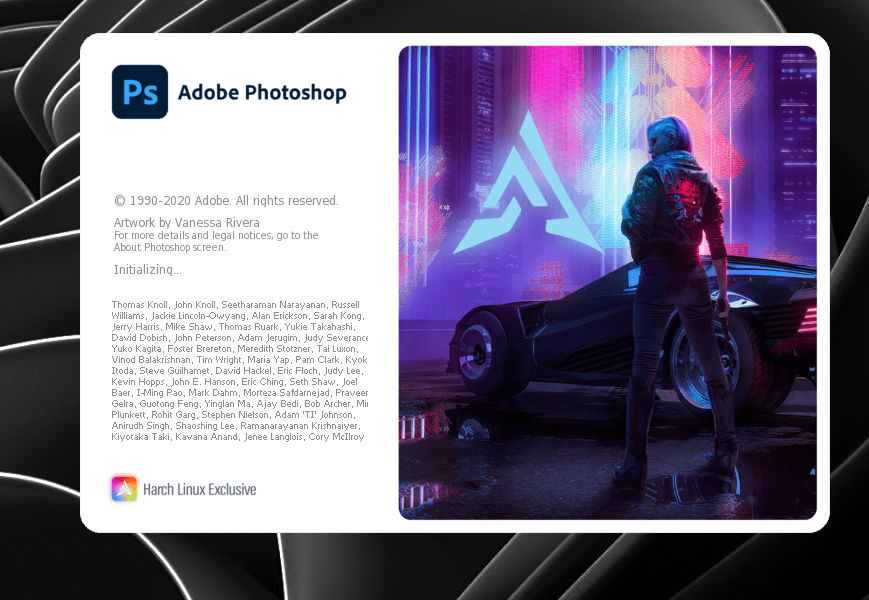

# Adobe photoshop 2020 v20) for Linux via Wine


> **Professional-grade photo design on Linux**  
> A repackaged version of Adobe photoshop 2020 optimized for Linux with Wine integration.

---

## 🚀 Features
- **Native-like Performance**  
  Pre-configured Wine prefix with performance tweaks
- **Dark Mode Support**  
  Auto-configured Yaru dark theme (modifiable)
- **One-Click Launch**  
  Desktop entry + CLI command (`photoshop-2020`)
- **Dependency Automation**  
  Installs required components (VC++ 2013, corefonts)
- **Isolated Environment**  
  Dedicated Wine prefix in `/opt/photoshop-2020`

---

## 📥 Installation

### Prerequisites
- Arch Linux (or derivatives with AUR support)
- Base-devel package group

## Enable Required Repositories
```bash
# 1. Enable Multilib
sudo sed -i '/\[multilib\]/,/Include/s/^#//' /etc/pacman.conf

# 2. Add ArchLinuxCN
echo -e "\n[archlinuxcn]\nServer = https://mirrors.ustc.edu.cn/archlinuxcn/\$arch" | sudo tee -a /etc/pacman.conf

# 3. Update and install keyring
sudo pacman -Syu archlinuxcn-keyring
```
### install with easy installer
```bash
wget https://github.com/harchlinux/photoshop-2020-linux/releases/download/17.0.0/photoshop-2020-wine-17-1-x86_64.pkg.tar.zst
sudo pacman -U ./photoshop-2020-wine-17-1-x86_64.pkg.tar.zst

```
# Post-install setup (automatic)
- Wine prefix initialization
- Dependency installation
- Permission fixes


---

## 🛠️ Technical Details
| Category       | Specification                  |
|---------------|-------------------------------|
| **Package**   | `photoshop-2020-wine`         |
| **Version**   | 20 (CC 2020)                  |
| **Arch**      | x86_64                        |
| **Wine**      | Win64 prefix                  |
| **Deps**      | wine, winetricks, lib32-*     |

---
## 🖥️ Usage


### CLI Launch
```bash
photoshop-2020
```

### Desktop
Search for " photoshop 2020" in your application menu.

---
## 🐧 Distribution Compatibility

**Warning**: This package is specifically designed for **Arch-based distributions** only.  

### ✅ Supported Distributions  
| Distribution | Tested Status | Notes |
|--------------|---------------|-------|
| Arch Linux | ✔️ Fully working | Native support |
| harch Linux | ✔️ Fully working | Native support |
| Manjaro | ✔️ Working | Kernel 6.5+ recommended |
| EndeavourOS | ✔️ Verified |  Requires manual dependency checks  |
| ArcoLinux | ⚠️ Partial | Requires manual dependency checks |

### ❌ Unsupported Distributions  
- Debian/Ubuntu (`.deb`-based)  
- Fedora/RHEL (`.rpm`-based)  
- OpenSUSE  
- Other non-Arch systems  

### Technical Limitations  
1. **Dependency Handling**:  
   Relies on Arch's `lib32-*` package naming convention  
2. **Installation Method**:  
   Requires `makepkg` (exclusive to Arch-based systems)  
3. **Wine Configuration**:  
   Optimized for Arch's Wine build (`wine-staging` recommended)  

---
## ⚠️ Legal & Licensing
**Important**: This package **does not** include Adobe Illustrator. You must:
1. Own a legal copy of photoshop 2020 v20
2. Comply with [Adobe's EULA](https://www.adobe.com/legal/terms.html)
3. Provide your own `IllustratorCC64.exe`

This project only provides:
- Wine configuration
- Linux integration scripts
- Packaging infrastructure

---

## ❓ FAQ
### Q: Why version 20 specifically?
A:  cc v20 has the best Wine compatibility balance between features and stability.

### Q: How to enable GPU acceleration?
```bash
winetricks -q vkd3d
```

---

## 🌍 Contributing
Pull requests welcome for:
- [ ] Improved Wine configurations
- [ ] Better HiDPI support
- [ ] Additional distro compatibility

Report issues for:
- Crashes with specific tools
- Installation problems
- Performance bottlenecks

---

## 📜 License
See [LICENSE](LICENSE) for packaging terms.  
Adobe software requires separate legal acquisition.

## 📬 Contact
- Email: miladalizade8282@gmail.com  
- Telegram: [@miladalizadw](https://t.me/miladalizadw)
